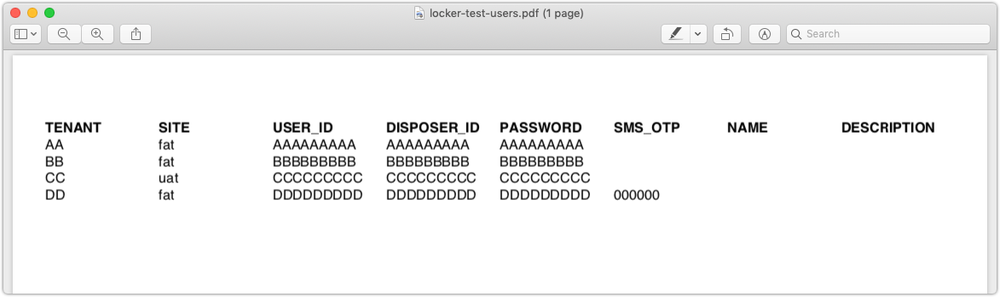

[](https://travis-ci.org/sgoeschl/freemarker-cli)

# 1. Is This Project For You?

You somehow found this GitHub project and wonder if it solves a problem you might have?!

* You need to transform some structured text document (CSV, HTML, JSON, XML, YAML, Java Property files, access logs) into CSV, HTML, Markdown or Confluence markup?
* You need to convert an Excel document into CSV, HTML or Markdown?
* You need to create a nice-looking PDF from some boring-looking CSV or JSON content ?

The goal of `freemarker-cli` is to automate repeated transformation tasks 

* Which are too boring to be done manually 
* Which happen not often enough to write a dedicated script or program

Assuming that you are still interested - run `./run-samples.sh` and have a look at the generated output

```text
./run-samples.sh 
templates/demo.ftl
templates/csv/html/transform.ftl
templates/csv/md/transform.ftl
templates/csv/shell/curl.ftl
templates/csv/fo/transform.ftl
fop -fo target/out/locker-test-users.fo target/out/locker-test-users.pdf
templates/csv/fo/transactions.ftl
fop -fo target/out/transactions.fo target/out/transactions-fo.pdf
templates/csv/html/transform.ftl
wkhtmltopdf -O landscape target/out/transactions.html target/out/transactions-html.pdf
templates/accesslog/combined-access.ftl
templates/excel/html/transform.ftl
templates/excel/md/transform.ftl
templates/excel/csv/transform.ftl
templates/excel/csv/custom.ftl
templates/html/csv/dependencies.ftl
templates/json/csv/swagger-endpoints.ftl
templates/json/html/customer-user-products.ftl
wkhtmltopdf -O landscape target/out/customer-user-products.html target/out/customer-user-products.pdf
templates/json/md/customer-user-products.ftl
templates/json/md/github-users.ftl
templates/properties/csv/locker-test-users.ftl
templates/yaml/txt/transform.ftl
templates/xml/txt/recipients.ftl
Created the following sample files in ./target/out
total 1072
-rw-r--r--  1 sgoeschl  staff     646 Oct 12 22:10 combined-access.log.txt
-rw-r--r--  1 sgoeschl  staff   22548 Oct 12 22:10 contract.html
-rw-r--r--  1 sgoeschl  staff    7933 Oct 12 22:10 contract.md
-rw-r--r--  1 sgoeschl  staff     784 Oct 12 22:10 curl.sh
-rw-r--r--  1 sgoeschl  staff  103487 Oct 12 22:11 customer-user-products.html
-rw-r--r--  1 sgoeschl  staff   34990 Oct 12 22:11 customer-user-products.md
-rw-r--r--  1 sgoeschl  staff  113615 Oct 12 22:11 customer-user-products.pdf
-rw-r--r--  1 sgoeschl  staff     232 Oct 12 22:11 customer.txt
-rw-r--r--  1 sgoeschl  staff    5928 Oct 12 22:10 demo.txt
-rw-r--r--  1 sgoeschl  staff    1310 Oct 12 22:11 dependencies.csv
-rw-r--r--  1 sgoeschl  staff    2029 Oct 12 22:11 github-users-curl.md
-rw-r--r--  1 sgoeschl  staff     239 Oct 12 22:11 locker-test-users.csv
-rw-r--r--  1 sgoeschl  staff    6288 Oct 12 22:10 locker-test-users.fo
-rw-r--r--  1 sgoeschl  staff    5488 Oct 12 22:10 locker-test-users.pdf
-rw-r--r--  1 sgoeschl  staff     921 Oct 12 22:11 recipients.txt
-rw-r--r--  1 sgoeschl  staff     341 Oct 12 22:11 swagger-spec.csv
-rw-r--r--  1 sgoeschl  staff     156 Oct 12 22:11 test-multiple-sheets.xlsx.csv
-rw-r--r--  1 sgoeschl  staff    1917 Oct 12 22:11 test-multiple-sheets.xlsx.html
-rw-r--r--  1 sgoeschl  staff     389 Oct 12 22:11 test-multiple-sheets.xlsx.md
-rw-r--r--  1 sgoeschl  staff     150 Oct 12 22:11 test-transform-xls.csv
-rw-r--r--  1 sgoeschl  staff    1556 Oct 12 22:10 test.xls.html
-rw-r--r--  1 sgoeschl  staff    1558 Oct 12 22:10 test.xslx.html
-rw-r--r--  1 sgoeschl  staff   11333 Oct 12 22:10 transactions-fo.pdf
-rw-r--r--  1 sgoeschl  staff   33235 Oct 12 22:10 transactions-html.pdf
-rw-r--r--  1 sgoeschl  staff  106441 Oct 12 22:10 transactions.fo
-rw-r--r--  1 sgoeschl  staff   18126 Oct 12 22:10 transactions.html
```

Please note that generated PDF files are very likely not found since they require `wkhtmltopdf` and `Apache FOP` installation.

# 2. Once Upon A Time

In December 2015 I needed a little bit of test data management for a customer project - to make a long story short (after writing a few more Groovy scripts) it boiled down to transforming one or more JSON files to something human readable.

What are the options?

* The cool kids say 'Node.js' - but they always say 'Node.js' 
* Some fancy Groovy scripts using Groovy's markup builder - but the syntax looks a bit odd
* Using 'JsonPath' and 'Velocity' to reuse good & old stuff

So I went with 'Apache Groovy', 'JsonPath' and 'Apache Velocity'

* Playing with Groovy over the public holidays
* Groovy has a built-in package manager which makes distribution a breeze
* Provding samples to transform JSON to Markdown

Using Velocity actually created some minor issues so I migrated to [Apache FreeMarker](https://freemarker.apache.org) during Christmas 2016

* Velocity 1.7 was released 2010 and only recently there was a new release
* I was painful to get Velocity Tools working
* Velocity XML processing support is also painful
* Spring 4.3 deprecated Velocity support which could affect me in the long run
* Freemarker has no additional dependencies and things are just working :-)

While I love Apache Velocity (Apache Turbine anyone?) I decided to give FreeMarker a chance and migrated my [velocity-cli](https://github.com/sgoeschl/velocity-cli) to FreeMarker.

Some years later the not-so-small Groovy script was still growing so I decided 

* To ditch Groovy and migrate to plain JDK 8
* Write unit tests since I had no more excuses
* To ditch Commons CLI and migrate to [Picocli](https://picocli.info)

# 3. Design Goals

* Support multiple files/directories for a single transformation
* Support transformation of Property files using plain-vanilla JDK
* Support transformation of CSV files using [Apache Commons CSV](https://commons.apache.org/proper/commons-csv/)
* Support transformation of JSON using [Jayway's JSONPath](https://github.com/jayway/JsonPath)
* Support transformation of Excel using [Apache POI](https://poi.apache.org)
* Support transformation of YAML using [SnakeYAML](https://bitbucket.org/asomov/snakeyaml/wiki/Home)
* XML is supported by FreeMarker out-of-the-box - see http://freemarker.org/docs/xgui.html
* Support for reading document content from STDIN to integrate with command line tools
* Add some commonly useful information such as `System Properties`, `Enviroment Variables`
* Create a proper command-line tool which has Unix look & feel

# 4. Usage

```text
> ./bin/freemarker-cli -h
Usage: freemarker-cli [-hvV] [--stdin] [-b=<baseDir>] [-e=<sourceEncoding>]
                      [--include=<include>] [-l=<locale>] [-o=<outputFile>]
                      [--output-encoding=<outputEncoding>] -t=<template>
                      [-D=<String=String>]... [<sources>...]
Apache FreeMarker CLI
      [<sources>...]        Any number of input source files and/or directories
  -b, --basedir=<baseDir>   Base directory to resolve FreeMarker templates
  -D=<String=String>        Set a system property
  -e, --source-encoding=<sourceEncoding>
                            Encoding of source file
  -h, --help                Show this help message and exit.
      --include=<include>   File pattern for directory search
  -l, --locale=<locale>     Locale being used for output file, e.g. 'en_US
  -o, --output=<outputFile> Output file
      --output-encoding=<outputEncoding>
                            Encoding of output file, e.g. UTF-8
      --stdin               Read source document from stdin
  -t, --template=<template> FreeMarker template used for rendering
  -v, --verbose             Verbose mode
  -V, --version             Print version information and exit.
```

# 5. Examples

The examples were tested with JDK 1.8 on Mac OS X

```text
> java -version
java version "1.8.0_192"
Java(TM) SE Runtime Environment (build 1.8.0_192-b12)
Java HotSpot(TM) 64-Bit Server VM (build 25.192-b12, mixed mode)
```

## 5.1 Transforming GitHub JSON To Markdown

A simple example with real JSON data

### Invocation

You can either use the existing JSON sample

> ./bin/freemarker-cli -t templates/json/md/github-users.ftl site/sample/json/github-users.json

or pipe a cURL response

> curl -s https://api.github.com/users | ./bin/freemarker-cli -t templates/json/md/github-users.ftl --stdin

### FreeMarker Template

```text
<#ftl output_format="plainText" >
<#assign json = JsonPath.parse(documents[0])>
<#assign users = json.read("$[*]")>
<#--------------------------------------------------------------------------->
# GitHub Users

Report generated at ${.now?iso_utc}

<#compress>
<#list users as user>
<#assign userAvatarUrl = user.avatar_url>
<#assign userHomeUrl = user.html_url>
# ${user.login}

| User                                                    | Homepage                                      |
|:--------------------------------------------------------|:----------------------------------------------|
|  | [${userHomeUrl}](${userHomeUrl})               |
</#list>
</#compress>
```

creates the following output


## 5.2 Markdown Test User Documentation

For a customer I created a Groovy script to fetch all products for a list of users - the script generates a JSON file which can be easily transformed to Markdown

```text
> ./bin/freemarker-cli -t templates/json/md/customer-user-products.ftl  site/sample/json/customer-user-products.json
```

The resulting file can be viewed with any decent Markdown viewer


Since many of our QA people have no Markdown viewer installed I also created a very similar HTML representaton

> ./bin/freemarker-cli -t templates/json/html/customer-user-products.ftl  site/sample/json/customer-user-products.json


As added bonus we can easily transform the HTML to PDF using [wkhtmltopdf](https://wkhtmltopdf.org)

```text
freemarker-cli> wkhtmltopdf ./site/sample/customer-user-products.html customer-user-products.pdf
Loading pages (1/6)
Counting pages (2/6)                                               
Resolving links (4/6)                                                       
Loading headers and footers (5/6)                                           
Printing pages (6/6)
Done  
```

which creates the following PDF document (please note that even the links within the document are working)


## 5.3 CSV to HTML/Markdown Transformation

Sometimes you have a CSV file which needs to be translated in Markdown or HTML - there are on-line solutions available such as [CSV To Markdown Table Generator](https://donatstudios.com/CsvToMarkdownTable) but having a local solution gives you more flexibility.

```text
> ./bin/freemarker-cli -t templates/csv/md/transform.ftl site/sample/csv/contract.csv
> ./bin/freemarker-cli -t templates/csv/html/transform.ftl site/sample/csv/contract.csv
```

The FreeMarker template is shown below

```text
<#ftl output_format="HTML" >
<#assign name = documents[0].name>
<#assign cvsFormat = CSVFormat.DEFAULT.withHeader()>
<#assign csvParser = CSVTool.parse(documents[0], cvsFormat)>
<#assign csvHeaders = csvParser.getHeaderNames()>
<#--------------------------------------------------------------------------->
<!DOCTYPE html>
<html>
<head>
    <title>${name}</title>
    <meta charset="UTF-8">
    <meta name="viewport" content="width=device-width, initial-scale=1">
    <link rel="stylesheet" href="https://maxcdn.bootstrapcdn.com/bootstrap/4.1.3/css/bootstrap.min.css">
</head>
<body>
<table class="table table-striped">
    <@writeHeaders csvParser.getHeaderNames()/>
    <#list csvParser.iterator() as record>
        <@writeColumns record/>
    </#list>
</table>
</body>
</html>
<#--------------------------------------------------------------------------->
<#macro writeHeaders headers>
    <tr>
        <#list headers as header>
            <th>${header}</th>
        </#list>
    </tr>
</#macro>
<#--------------------------------------------------------------------------->
<#macro writeColumns record>
    <tr>
        <#list record.iterator() as field>
            <th>${field}</th>
        </#list>
    </tr>
</#macro>

```

The resulting file actually looks pleasant when compared to raw CSV


## 5.4 Transform XML To Plain Text

Of course you can also transform a XML document

```text
> ./bin/freemarker-cli -t ./templates/xml/txt/recipients.ftl site/sample/xml/recipients.xml
```

using the following template

```text
<#ftl output_format="plainText" >
<#assign xml = XmlParser.parse(documents[0])>
<#list xml.recipients.person as recipient>
To: ${recipient.name}
${recipient.address}

Dear ${recipient.name},

Thank you for your interest in our products. We will be sending you a catalog shortly.
To take advantage of our free gift offer, please fill in the survey attached to this
letter and return it to the address on the reverse. Only one participant is allowed for
each household.

Sincere salutations,


D. H.

---------------------------------------------------------------------------------------
</#list>

```

which generates the following output

```text
To: John Smith
3033 Long Drive, Houston, TX

Dear John Smith,

Thank you for your interest in our products. We will be sending you a catalog shortly.
To take advantage of our free gift offer, please fill in the survey attached to this
letter and return it to the address on the reverse. Only one participant is allowed for
each household.

Sincere salutations,


D. H.
```

## 5.5 Transform JSON To CSV

One day I was asked a to prepare a CSV files containind REST endpoints described by Swagger - technically this is a JSON to CSV transformation. Of course I could create that CSV manually but writing a FTL template doing that was simply more fun and saves time in the future.

```text
<#ftl output_format="plainText" >
<#assign xml = XmlTool.parse(documents[0])>
<#list xml.recipients.person as recipient>
To: ${recipient.name}
${recipient.address}

Dear ${recipient.name},

Thank you for your interest in our products. We will be sending you a catalog shortly.
To take advantage of our free gift offer, please fill in the survey attached to this
letter and return it to the address on the reverse. Only one participant is allowed for
each household.

Sincere salutations,


D. H.

---------------------------------------------------------------------------------------
</#list>

```

Invoking the FTL template

> ./bin/freemarker-cli -t templates/json/csv/swagger-endpoints.ftl site/sample/json/swagger-spec.json 

gives you

```text
ENDPOINT;METHOD;DESCRIPTION
/api/pets;GET;Returns all pets from the system that the user has access to
/api/pets;POST;Creates a new pet in the store. Duplicates are allowed
/api/pets/{id};GET;Returns a user based on a single ID, if the user does not have access to the pet
/api/pets/{id};DELETE;Deletes a single pet based on the ID supplied
```

## 5.6 Transforming Excel Documents

Another day my project management asked me to create a CSV configuration file based on an Excel documents - as usual manual copying was not an option due to required data cleanup and data transformation. So I thought about Apache POI which support XLS and XLSX documents - integration of Apache POI was a breeze but the resulting code was not particulary useful example. So a more generic transformation was provided to show the transformation of Excel documents ...

```text
> ./bin/freemarker-cli -t templates/excel/html/transform.ftl site/sample/excel/test.xls
> ./bin/freemarker-cli -t templates/excel/html/transform.ftl site/sample/excel/test.xlsx
> ./bin/freemarker-cli -t templates/excel/html/transform.ftl site/sample/excel/test-multiple-sheets.xlsx
> ./bin/freemarker-cli -t templates/excel/md/transform.ftl site/sample/excel/test-multiple-sheets.xlsx
```

The provided FTL transforms an Excel into a HTML document supporting multiple Excel sheets

```text
<#ftl output_format="HTML" >
<#assign documentName = documents[0].name>
<#assign workbook = ExcelTool.parse(documents[0])>
<#assign date = .now?iso_utc>
<#--------------------------------------------------------------------------->
<!DOCTYPE html>
<html>
<head>
    <title>${documentName}</title>
    <meta charset="UTF-8">
    <meta name="viewport" content="width=device-width, initial-scale=1">
    <link rel="stylesheet" href="https://maxcdn.bootstrapcdn.com/bootstrap/4.1.3/css/bootstrap.min.css">
</head>
<body>
<div class="container-fluid">
    <h1>Excel Test
        <small>${documentName}, ${date}</small>
    </h1>
    <@writeSheets workbook/>
</div>
</body>
</html>

<#--------------------------------------------------------------------------->
<#-- writeSheets                                                           -->
<#--------------------------------------------------------------------------->
<#macro writeSheets workbook>
    <#assign sheets = ExcelTool.getSheets(workbook)>
    <#list sheets as sheet>
        <@writeSheet sheet/>
    </#list>
</#macro>

<#--------------------------------------------------------------------------->
<#-- writeSheet                                                            -->
<#--------------------------------------------------------------------------->
<#macro writeSheet sheet>
    <#assign rows = ExcelTool.parseSheet(sheet)>
    <h2>${sheet.getSheetName()}</h2>
    <@writeRows rows/>
</#macro>

<#--------------------------------------------------------------------------->
<#-- writeRows                                                             -->
<#--------------------------------------------------------------------------->
<#macro writeRows rows>
    <table class="table table-striped">
        <#list rows as row>
            <#if row?is_first>
                <tr>
                    <th>#</th>
                    <#list row as column>
                        <th>${column}</th>
                    </#list>
                </tr>
            <#else>
                <tr>
                    <td>${row?index}</td>
                    <#list row as column>
                        <td>${column}</td>
                    </#list>
                </tr>
            </#if>
        </#list>
    </table>
</#macro>


```

but the result looks reasonable


## 5.7 Transform Property Files To CSV

In this sample we transform all property files found in a directory (recursive search using include pattern) to a CSV file

```text
> ./bin/freemarker-cli --include *.properties -t templates/properties/csv/locker-test-users.ftl site/sample/properties
TENANT,SITE,USER_ID,DISPOSER_ID,PASSWORD,SMS_OTP,NAME,DESCRIPTION
???,fat,01303494,01303494,01303494,,,
???,fat,9422350309,9422350309,9422350309,000000,,
???,fat,205089760,205089760,205089760,,,
???,uat,9200021464,9200021464,9200021464,,,
```

The FTL uses a couple of interesting features

* We process a list of property files
* The `strip_text` and `compress` strips any white-spaces and line-breaks from the output so we can create a proper CSV file
* We use FTL functions to extract the `tenant` and `site`, e.g. `extractTenant`
* We add a manual line break using ```${'\n'}```

```text
<#ftl output_format="plainText" strip_text="true">
<#compress>
    TENANT,SITE,USER_ID,DISPOSER_ID,PASSWORD,SMS_OTP,NAME,DESCRIPTION
    <#list documents as document>
        <#assign properties = PropertiesTool.parse(document)>
        <#assign environments = properties["ENVIRONMENTS"]!"">
        <#assign tenant = extractTenant(environments)>
        <#assign site = extractSite(environments)>
        <#assign userId = properties["USER_ID"]!"">
        <#assign disposerId = properties["USER_ID"]!"">
        <#assign password = properties["PASSWORD"]!"">
        <#assign smsOtp = properties["SMS_OTP"]!"">
        <#assign name = properties["NAME"]!"">
        <#assign description = properties["NAME"]!"">
        ${tenant},${site},${userId},${disposerId},${password},${smsOtp},${name},${description}
    </#list>
</#compress>
${'\n'}

<#function extractSite environments>
    <#if (environments)?contains("_DEV")>
        <#return "dev">
    <#elseif (environments)?contains("_FAT")>
        <#return "fat">
    <#elseif (environments)?contains("_ST")>
        <#return "st">
    <#elseif (environments)?contains("_PROD")>
        <#return "prod">
    <#elseif (environments)?contains("_UAT")>
        <#return "uat">
    <#else>
        <#return "???">
    </#if>
</#function>

<#function extractTenant environments>
    <#if (environments)?contains("AT_")>
        <#return "at">
    <#elseif (environments)?contains("BCR_")>
        <#return "ro">
    <#elseif (environments)?contains("CSAS_")>
        <#return "cz">
    <#elseif (environments)?contains("SK_")>
        <#return "sk">
    <#else>
        <#return "???">
    </#if>
</#function>

```

## 5.8 Transform CSV To XML-FO

For a POC (proof of concept) I created a sample transformation from CSV to XML-FO in order to create a PDF document using [Apache FOP](https://xmlgraphics.apache.org/fop) using the following template file

```text
<#ftl output_format="XML" >
<#assign name = documents[0].name>
<#assign csvFormatName = SystemProperties["csv.format"]!"DEFAULT">
<#assign cvsFormat = CSVFormat[csvFormatName].withHeader()>
<#assign csvParser = CSVTool.parse(documents[0], cvsFormat)>
<#assign csvHeaders = csvParser.getHeaderMap()?keys>
<#assign csvRecords = csvParser.records>
<#--------------------------------------------------------------------------->
<?xml version="1.0" encoding="UTF-8"?>

<fo:root xmlns:fo="http://www.w3.org/1999/XSL/Format">
    <fo:layout-master-set>
        <fo:simple-page-master master-name="first"
                               page-height="21cm"
                               page-width="29.7cm"
                               margin-top="1cm"
                               margin-bottom="1cm"
                               margin-left="1cm"
                               margin-right="1cm">
            <fo:region-body margin-top="1cm"/>
            <fo:region-before extent="1cm"/>
            <fo:region-after extent="1cm"/>
        </fo:simple-page-master>
    </fo:layout-master-set>
    <fo:page-sequence master-reference="first">
        <fo:flow flow-name="xsl-region-body">
            <fo:table table-layout="fixed" width="100%" border-collapse="separate">
                <@writeTableHeader headers=csvHeaders/>
                <@writeTableBody columns=csvRecords/>
            </fo:table>
        </fo:flow>
    </fo:page-sequence>
</fo:root>

<#--------------------------------------------------------------------------->
<#macro writeTableHeader headers>
    <fo:table-header>
        <fo:table-row>
            <#list headers as header>
                <fo:table-cell>
                    <fo:block font-weight="bold">${header}</fo:block>
                </fo:table-cell>
            </#list>
        </fo:table-row>
    </fo:table-header>
</#macro>

<#--------------------------------------------------------------------------->
<#macro writeTableBody columns>
    <fo:table-body>
        <#list columns as column>
            <fo:table-row>
                <#list column.iterator() as field>
                    <fo:table-cell>
                        <fo:block>${field}</fo:block>
                    </fo:table-cell>
                </#list>
            </fo:table-row>
        </#list>
    </fo:table-body>
</#macro>

```

In order to create the PDF you need to execute the following commands (assuming that you have Apache FOP installed)

```text
> ./bin/freemarker-cli -t templates/csv/fo/transform.ftl site/sample/csv/locker-test-users.csv > sample.fo
> fop -fo sample.fo sample.pdf
Dec 29, 2018 10:24:30 PM org.apache.fop.events.LoggingEventListener processEvent
WARNING: Font "Symbol,normal,700" not found. Substituting with "Symbol,normal,400".
Dec 29, 2018 10:24:30 PM org.apache.fop.events.LoggingEventListener processEvent
WARNING: Font "ZapfDingbats,normal,700" not found. Substituting with "ZapfDingbats,normal,400".
Dec 29, 2018 10:24:30 PM org.apache.fop.events.LoggingEventListener processEvent
INFO: Rendered page #1.
```

The result does not look very impressive but it is a PDF :-)



Further along the line of the POC we converted a transaction export from CSV to PDF using Apache FOP

```text
> ./bin/freemarker-cli -t templates/csv/fo/transactions.ftl site/sample/csv/transactions.csv > transactions.fo
> fop -fo transactions.fo transactions.pdf
Jan 16, 2019 11:15:21 PM org.apache.fop.events.LoggingEventListener processEvent
WARNING: Font "Symbol,normal,700" not found. Substituting with "Symbol,normal,400".
Jan 16, 2019 11:15:21 PM org.apache.fop.events.LoggingEventListener processEvent
WARNING: Font "ZapfDingbats,normal,700" not found. Substituting with "ZapfDingbats,normal,400".
Jan 16, 2019 11:15:21 PM org.apache.fop.events.LoggingEventListener processEvent
WARNING: The contents of fo:block line 1 exceed the available area in the inline-progression direction by 11027 millipoints. (See position 1519:51)
Jan 16, 2019 11:15:22 PM org.apache.fop.events.LoggingEventListener processEvent
INFO: Rendered page #1.
Jan 16, 2019 11:15:22 PM org.apache.fop.events.LoggingEventListener processEvent
INFO: Rendered page #2.
```


## 5.9 Transforming HTML To CSV

Recently I got the rather unusual question how to determine the list of dependecied of an application - one easy way is the Maven "dependencies.html" but this is unstructured data. Having said that the Jsoup library is perfectly able to parse most real-life HTML and provides a DOM model

```text
<#ftl output_format="plainText" strip_text="true">
<#assign documentName = documents[0].name>
<#assign html = JsoupTool.parse(documents[0])>

<#compress>
    <@writeHeader/>
    <@writeDependencies "Project_Dependencies_compile"/>
    <@writeDependencies "Project_Transitive_Dependencies_compile"/>
    <@writeDependencies "Project_Transitive_Dependencies_runtime"/>
    <@writeDependencies "Project_Transitive_Dependencies_provided"/>
</#compress>

<#macro writeHeader>
    GroupId,ArtifactId,Version,Type,Licenses
</#macro>

<#macro writeDependencies section>
    <#assign selection = html.select("a[name=${section}]")>
    <#if selection?has_content>
        <#assign table = selection[0].nextElementSibling().child(2).child(0)>
        <#assign rows = table.children()>
        <#list rows as row>
            <#if !row?is_first>
                <#assign groupId = row.child(0).text()>
                <#assign artificatId = row.child(1).text()>
                <#assign version = row.child(2).text()>
                <#assign type = row.child(3).text()>
                <#assign licences = row.child(4).text()?replace(",", "")>
                ${groupId},${artificatId},${version},${type},${licences}
            </#if>
        </#list>
    </#if>
</#macro>

```

Your dependencies as CSV can be generated as shown below

```text
> ./bin/freemarker-cli -t templates/html/csv/dependencies.ftl site/sample/html/dependencies.html 
GroupId,ArtifactId,Version,Type,Licenses
com.jayway.jsonpath,json-path,2.4.0,jar,The Apache Software License Version 2.0
commons-cli,commons-cli,1.4,jar,Apache License Version 2.0
org.apache.commons,commons-csv,1.5,jar,Apache License Version 2.0
org.apache.poi,poi,4.0.1,jar,The Apache Software License Version 2.0
org.apache.poi,poi-ooxml,3.17,jar,The Apache Software License Version 2.0
org.apache.poi,poi-ooxml-schemas,3.17,jar,The Apache Software License Version 2.0
org.freemarker,freemarker,2.3.28,jar,Apache License Version 2.0
org.jsoup,jsoup,1.11.3,jar,The MIT License
org.slf4j,slf4j-api,1.7.21,jar,MIT License
org.slf4j,slf4j-log4j12,1.7.21,jar,MIT License
com.github.virtuald,curvesapi,1.04,jar,BSD License
commons-codec,commons-codec,1.11,jar,Apache License Version 2.0
log4j,log4j,1.2.17,jar,The Apache Software License Version 2.0
net.minidev,accessors-smart,1.2,jar,The Apache Software License Version 2.0
net.minidev,json-smart,2.3,jar,The Apache Software License Version 2.0
org.apache.commons,commons-collections4,4.2,jar,Apache License Version 2.0
org.apache.commons,commons-math3,3.6.1,jar,Apache License Version 2.0
org.apache.xmlbeans,xmlbeans,2.6.0,jar,The Apache Software License Version 2.0
org.ow2.asm,asm,5.0.4,jar,BSD
stax,stax-api,1.0.1,jar,The Apache Software License Version 2.0
```

## 5.10 Transform CSV To Shell Script

For a customer project we wanted to record REST request / responses using WireMock - really quick and dirty. So we decided to avoid any sophisticated test tool but generate a ready-to-use shell script executing cURL commands. It turned out that handling of dollar signs is a bit tricky

* Using ```noparse``` directive to disable parsing of dollar signs
* Using ```${r"${MY_BASE_URL}"``` to generate output with dollar signs

and the final FTL is found below

```
<#ftl output_format="plainText">
<#assign cvsFormat = CSVFormat.DEFAULT.withHeader()>
<#assign csvParser = CSVTool.parse(documents[0], cvsFormat)>
<#assign records = csvParser.records>
<#assign csvMap = CSVTool.toMap(records, "disposer")>
<#--------------------------------------------------------------------------->
#!/bin/sh

<#noparse>
MY_BASE_URL=${MY_BASE_URL:=https://postman-echo.com}
</#noparse>
 
echo "time,user,status,duration,size"
<#list records as record>
date "+%FT%H:%M:%S" | tr -d '\n'; curl --write-out ',${record.disposer},%{http_code},%{time_total},%{size_download}\n' --silent --show-error --output /dev/null "${r"${MY_BASE_URL}"}/get"
</#list>


```

Rendering the FreeMarker template 

```
> ./bin/freemarker-cli -t ./templates/csv/shell/curl.ftl site/sample/csv/user.csv
```

generates the following shell script

```
#!/bin/sh

MY_BASE_URL=${MY_BASE_URL:=https://postman-echo.com}
 
echo "time,user,status,duration,size"
date "+%FT%H:%M:%S" | tr -d '\n'; curl --write-out ',AAAAAAA,%{http_code},%{time_total},%{size_download}\n' --silent --show-error --output /dev/null "${MY_BASE_URL}/get"
date "+%FT%H:%M:%S" | tr -d '\n'; curl --write-out ',BBBBBBB,%{http_code},%{time_total},%{size_download}\n' --silent --show-error --output /dev/null "${MY_BASE_URL}/get"
date "+%FT%H:%M:%S" | tr -d '\n'; curl --write-out ',CCCCCCC,%{http_code},%{time_total},%{size_download}\n' --silent --show-error --output /dev/null "${MY_BASE_URL}/get"
date "+%FT%H:%M:%S" | tr -d '\n'; curl --write-out ',DDDDDDD,%{http_code},%{time_total},%{size_download}\n' --silent --show-error --output /dev/null "${MY_BASE_URL}/get"
```

Looks a bit complicated but lets dissect the things

* `date "+%FT%H:%M:%S" | tr -d '\n'` creates a timestamp and removes the line feed
* `curl --write-out` allows to print runtime data (see [https://ec.haxx.se/usingcurl-writeout.html](https://ec.haxx.se/usingcurl-writeout.html))

Executing the result shell script creates the following output (which is a nice CSV for further processing)

```
time,user,status,duration,size
2019-09-27T21:02:52,AAAAAAA,200,0.522473,206
2019-09-27T21:02:53,BBBBBBB,200,0.498093,206
2019-09-27T21:02:54,CCCCCCC,200,0.529013,206
2019-09-27T21:02:54,DDDDDDD,200,0.528268,206
```

## 5.11 Unleashing The Power Of Grok

Think of `Grok` as modular regular expressions with a pre-defined functionality to parse access logs or any other data where you can't comprehend the regular expression any longer, one very simple example is `QUOTEDSTRING`

```
QUOTEDSTRING (?>(?<!\\)(?>"(?>\\.|[^\\"]+)+"|""|(?>'(?>\\.|[^\\']+)+')|''|(?>`(?>\\.|[^\\`]+)+`)|``))
```

And with `Grok` the `QUOTEDSTRING` is just a building block for an even more complex regular expession such as `COMBINEDAPACHELOG`

> bin/freemarker-cli -t templates/accesslog/combined-access.ftl site/sample/accesslog/combined-access.log 

which gives you the following output

```
TIMESTAMP;VERB;REQUEST;HTTPVERSION
19/Jun/2005:06:44:17 +0200;GET;/wximages/wxwidgets02-small.png;1.1
19/Jun/2005:06:46:05 +0200;GET;/wximages/wxwidgets02-small.png;1.1
19/Jun/2005:06:47:37 +0200;GET;/wximages/wxwidgets02-small.png;1.1
19/Jun/2005:06:48:40 +0200;GET;/wiki.pl?WxWidgets_Bounties;1.1
19/Jun/2005:06:50:49 +0200;GET;/wiki.pl?WxWidgets_Compared_To_Other_Toolkits;1.1
19/Jun/2005:06:50:49 +0200;GET;/wxwiki.css;1.1
19/Jun/2005:06:50:49 +0200;GET;/wximages/wxwidgets02-small.png;1.1
19/Jun/2005:06:50:50 +0200;GET;/favicon.ico;1.1
19/Jun/2005:06:52:36 +0200;GET;/wximages/wxwidgets02-small.png;1.1
19/Jun/2005:06:53:14 +0200;GET;/;1.0
```

using the following FreeMarker template

```
<#ftl output_format="plainText" strip_whitespace=true>
<#assign grok = GrokTool.compile("%{COMBINEDAPACHELOG}")>
<#assign lines = documents[0].getLineIterator()>

<#compress>
    TIMESTAMP;VERB;REQUEST;HTTPVERSION
    <#list lines as line>
        <#assign parts = grok.match(line)>
        <#assign timestamp = parts["timestamp"]>
        <#assign verb = parts["verb"]>
        <#assign request = parts["request"]>
        <#assign httpversion = parts["httpversion"]>
        ${timestamp};${verb};${request};${httpversion}
    </#list>
</#compress>
```

While this looks small and tidy there are some nifty features

* `GrokTool.compile("%{COMBINEDAPACHELOG}")` builds the `Grok` instance to parse access logs in `Combined Format`
* The source document is streamed line by line and not loaded into memory in one piece
* This also works for using `stdin` so are able to parse GB of access log or other files

## 5.12 CSV Transformation

Sometimes you have a CSV file which is not quite right - you need to change the format. Lets have a look how `freemarker-cli` can help

> bin/freemarker-cli -Dcsv.in.delimiter=COMMA -Dcsv.out.delimiter=PIPE -t templates/csv/transform.ftl ./site/sample/csv/contract.csv 

renders the following template

```
<#ftl output_format="plainText" strip_text="true">
<#-- Parse incoming CSV with user-supplied configuration -->
<#assign initialCvsInFormat = CSVFormat[SystemTool.getProperty("csv.in.format", "DEFAULT")]>
<#assign csvInDelimiter = CSVTool.toDelimiter(SystemTool.getProperty("csv.in.delimiter", initialCvsInFormat.getDelimiter()))>
<#assign cvsInFormat = initialCvsInFormat.withDelimiter(csvInDelimiter)>
<#assign csvParser = CSVTool.parse(documents[0], cvsInFormat)>
<#-- Create outgoing CSV with user-supplied configuration -->
<#assign initialCvsOutFormat = CSVFormat[SystemTool.getProperty("csv.out.format", "DEFAULT")]>
<#assign csvOutDelimiter = CSVTool.toDelimiter(SystemTool.getProperty("csv.out.delimiter", initialCvsOutFormat.getDelimiter()))>
<#assign cvsOutFormat = initialCvsOutFormat.withDelimiter(csvOutDelimiter)>
<#assign csvPrinter = CSVTool.printer(cvsOutFormat)>
<#-- Print each line without materializing the CSV in memory -->
<#compress>
    <#list csvParser.iterator() as record>
        ${csvPrinter.printRecord(record)}
    </#list>
</#compress>


```

and generates

```text
contract_id|seller_company_name|customer_company_name|customer_duns_number|contract_affiliate|FERC_tariff_reference|contract_service_agreement_id|contract_execution_date|contract_commencement_date|contract_termination_date|actual_termination_date|extension_provision_description|class_name|term_name|increment_name|increment_peaking_name|product_type_name|product_name|quantity|units_for_contract|rate|rate_minimum|rate_maximum|rate_description|units_for_rate|point_of_receipt_control_area|point_of_receipt_specific_location|point_of_delivery_control_area|point_of_delivery_specific_location|begin_date|end_date|time_zone
C71|The Electric Company|The Power Company|456543333|N|FERC Electric Tariff Original Volume No. 10|2|2/15/2001|2/15/2001|||Evergreen|N/A|N/A|N/A|N/A|MB|ENERGY|0||" "|" "|" "|Market Based||||||||ES
C72|The Electric Company|Utility A|38495837|n|FERC Electric Tariff Original Volume No. 10|15|7/25/2001|8/1/2001|||Evergreen|N/A|N/A|N/A|N/A|MB|ENERGY|0||" "|" "|" "|Market Based||||||||ES
C73|The Electric Company|Utility B|493758794|N|FERC Electric Tariff Original Volume No. 10|7|6/8/2001|7/6/2001|||Evergreen|N/A|N/A|N/A|N/A|MB|ENERGY|0||" "|" "|" "|Market Based||||" "|" "|||ep
C74|The Electric Company|Utility C|594739573|n|FERC Electric Tariff Original Volume No. 10|25|6/8/2001|7/6/2001|||Evergreen|N/A|N/A|N/A|N/A|MB|ENERGY|0||" "|" "|" "|Market Based||||" "|" "|||ep
```

Some useful hints

* For available CSV formats please see [Apache Commons CSV User Guide](http://commons.apache.org/proper/commons-csv/user-guide.html)
* Stripping the Excel BOM (Byte Order Mark) works out-of-box

## 5.13 Using Advanced FreeMarker Features

There is a `demo.ftl` which shows some advanced FreeMarker functionality

* Invoking a Java constructor
* Invoke a static method of non-instantiable class
* Work with Java enums
* Access System properties
* Access Environment variables

Running 

> ./bin/freemarker-cli -t templates/demo.ftl 

gives you

```text
1) FreeMarker Special Variables
---------------------------------------------------------------------------

FreeMarker version     : 2.3.29
Template name          : templates/demo.ftl
Language               : en
Locale                 : en_AT
Timestamp              : Oct 11, 2019 11:08:50 PM
Output encoding        : UTF-8
Output format          : plainText

2) Invoke a constructor of a Java class
---------------------------------------------------------------------------
new java.utilDate(1000 * 3600 * 24): Jan 2, 1970 1:00:00 AM

3) Invoke a static method of an non-constructor class
---------------------------------------------------------------------------
System.currentTimeMillis: 1,570,828,130,794

4) Access an Enumeration
---------------------------------------------------------------------------
java.math.RoundingMode#UP: UP

5) Loop Over The Values Of An Enumeration
---------------------------------------------------------------------------
* java.math.RoundingMode.UP
* java.math.RoundingMode.DOWN
* java.math.RoundingMode.CEILING
* java.math.RoundingMode.FLOOR
* java.math.RoundingMode.HALF_UP
* java.math.RoundingMode.HALF_DOWN
* java.math.RoundingMode.HALF_EVEN
* java.math.RoundingMode.UNNECESSARY

6) Display list of input files
---------------------------------------------------------------------------
List all files:

7) SystemTool
---------------------------------------------------------------------------
Host name       : murderbot.local
Command line    : -t, templates/demo.ftl
User name       : sgoeschl
Timestamp       : 1570828130811
Environment     : N.A.

8) Access System Properties
---------------------------------------------------------------------------
app.dir      : 
app.home     : /Users/sgoeschl/work/github/sgoeschl/freemarker-cli/target/appassembler
app.pid      : 10497
basedir      : /Users/sgoeschl/work/github/sgoeschl/freemarker-cli/target/appassembler
java.version : 1.8.0_192
user.name    : sgoeschl
user.dir     : /Users/sgoeschl/work/github/sgoeschl/freemarker-cli/target/appassembler
user.home    : /Users/sgoeschl

9) Environment Variables
---------------------------------------------------------------------------
* PATH ==> /Users/sgoeschl/bin:/Library/Java/JavaVirtualMachines/jdk1.8.0_192.jdk/Contents/Home/bin:/usr/local/Cellar/ruby/2.5.3//bin:/usr/local/Cellar/git/2.19.1/bin:/usr/local/bin:/usr/bin:/bin:/usr/sbin:/sbin:/Applications/Java/apache-fop-2.3:/Applications/Java/freemarker-cli-2.0.0/bin:/Applications/Java/gatling-3.1.2/bin
* GIT_HOME ==> /usr/local/Cellar/git/2.19.1
* JAVA_MAIN_CLASS_10497 ==> com.github.sgoeschl.freemarker.cli.Main
* JAVA_8_HOME ==> /Library/Java/JavaVirtualMachines/jdk1.8.0_192.jdk/Contents/Home
* JAVA_HOME ==> /Library/Java/JavaVirtualMachines/jdk1.8.0_192.jdk/Contents/Home
* FOP_HOME ==> /Applications/Java/apache-fop-2.3
* TERM ==> xterm-256color
* LANG ==> en_US
* MAVEN_OPTS ==> -Xmx2048m
* DISPLAY ==> :0.0
* JAVA_11_HOME ==> /Library/Java/JavaVirtualMachines/adoptopenjdk-11.jdk/Contents/Home
* BEEONE_NEXUS_CREDENTIALS ==> H50N0OB:fRidnevo0719!
* LOGNAME ==> sgoeschl
* XPC_SERVICE_NAME ==> 0
* PWD ==> /Users/sgoeschl/work/github/sgoeschl/freemarker-cli/target/appassembler
* TERM_PROGRAM_VERSION ==> 421.2
* RUBY_HOME ==> /usr/local/Cellar/ruby/2.5.3/
* SHELL ==> /bin/bash
* PROFILE_TYPE ==> development
* TERM_PROGRAM ==> Apple_Terminal
* LSCOLORS ==> ExFxCxDxBxegedabagacad
* PROFILE_ENV ==> default
* SECURITYSESSIONID ==> 186af
* USER ==> sgoeschl
* CLICOLOR ==> 1
* GATLING_HOME ==> /Applications/Java/gatling-3.1.2
* TMPDIR ==> /var/folders/cd/jbgc9cg14ld7dlsqk44tpmrw0000gn/T/
* SSH_AUTH_SOCK ==> /private/tmp/com.apple.launchd.iAFTu9i7PN/Listeners
* EDITOR ==> vi
* XPC_FLAGS ==> 0x0
* FREEMARKER_CLI_HOME ==> /Applications/Java/freemarker-cli-2.0.0
* TERM_SESSION_ID ==> 9D1F5DAC-5E97-449C-8A67-D839477D8611
* LC_ALL ==> en_US.utf-8
* __CF_USER_TEXT_ENCODING ==> 0x1F5:0x0:0x0
* Apple_PubSub_Socket_Render ==> /private/tmp/com.apple.launchd.ZtXUheG4n9/Render
* LC_CTYPE ==> UTF-8
* HOME ==> /Users/sgoeschl
* SHLVL ==> 1

10) Accessing Documents
---------------------------------------------------------------------------
Get the number of documents:
    - 0
List all files containing "README" in the name
List all files having "md" extension
Get all documents

11) Document Data Model
---------------------------------------------------------------------------

Top-level entries in the current data model

- YamlTool
- Statics
- SystemTool
- documents
- JsoupTool
- JsonPathTool
- XmlTool
- Enums
- SystemProperties
- ExcelTool
- Documents
- PropertiesTool
- ObjectConstructor
- Environment
- CSVTool
- CSVFormat

12) Create a UUID
---------------------------------------------------------------------------

See https://stackoverflow.com/questions/43501297/i-have-a-simplescalar-i-need-its-strings-getbytes-return-value-what-can-i-d

Random UUID           : 9524a0c8-0414-4956-829a-d05e4f8eda2e
Name UUID from bytes  : 298415f9-e888-3d98-90e7-6c0d63ad14dc
Name UUID as function : 298415f9-e888-3d98-90e7-6c0d63ad14dc

13) Printing Special Characters
---------------------------------------------------------------------------

German Special Characters: äöüßÄÖÜ

14) Locale-specific output
---------------------------------------------------------------------------

Small Number :  1.23
Large Number :  12,345,678.90
Currency     :  12,345,678.90 EUR
Date         :  Oct 11, 2019
Time         :  11:08:50 PM
```

# 6. Design Considerations

## 6.1 How It Works

* The user-supplied files are loaded into memory or if there are no file the script reads the from `stdin`
* The FreeMarker data model containing the documents and helper object is created and passed to the template
* The generated output is written to the user-supplied file or to `stdout`

## 6.2 FreeMarker Data Model

Within the script a FreeMarker data model is set up and passed to the template - it contains the documents to be processed and helper objects

| Helper                | Description                                                         |
|-----------------------|---------------------------------------------------------------------|
| CSVFormat             | Available CSV formats, e.g. "DEFAULT", "EXCEL"                      |
| CSVTool               | CSV parser exposing a `parse` method                                |
| Documents             | Helper to find documents, e.g. by name or extension                 |
| documents             | List of documents passed on the command line                        |
| Enums                 | Helper to work with Java enumerations                               |
| Environment           | Environment variables                                               |
| ExcelTool             | Excel parser exposing a `parse` method                              |
| GrokTool              | Use Grok for powerful regular expressions                           |
| JsonPathTool          | JSON Parser                                                         |
| JsoupTool             | Jsoup HTML parser                                                   |
| ObjectConstructor     | Creata Java instances using reflection                              |
| PropertiesTool        | Properties parser exposing a `parse` method                         |
| Statics               | Invoke static Java methods using reflection                         |
| SystemProperties      | JVM System properties                                               |
| XmlTool               | XML parser exposing a `parse` method                                |
| YamlTool              | SnakeYAML to parse YAML files                                       |

# 7. Tips & Tricks

## 7.1 Template Base Directory

When doing some ad-hoc scripting it is useful to rely on a base directory to resolve the FTL templates

* As a default the FTL templates are resolved relative to the script directory
* The caller can provide a `-b` or `--basedir` command line parameter

> ./bin/freemarker-cli -t templates/json/html/customer-user-products.ftl freemarker-cli/site/sample/json/customer-user-products.jso

## 7.2 Using Pipes

When doing ad-hoc scripting it useful to pipe the output of one command directly into "freemarker-cli"

> cat site/sample/json/customer-user-products.json | ./bin/freemarker-cli -t ./templates/json/html/customer-user-products.ftl --stdin